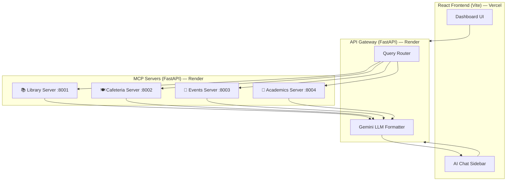

<p align="center">
  <strong>◈ MARS</strong><br/>
  <em>Multi-Access Resource System</em>
</p>

<p align="center">
  A Unified Campus Intelligence Dashboard with an embedded AI Assistant powered by independent MCP (Model Context Protocol) servers and Google Gemini.
</p>

<p align="center">
  
  
  
  
</p>

---

## ✨ Features

- **📚 Library** — Search books, check availability, view stats
- **🍽️ Cafeteria** — Today's menu, weekly meals, daily specials
- **📅 Events** — Upcoming events, clubs, category filters
- **📖 Academics** — Courses, schedules, deadlines, resources
- **🤖 AI Chat** — Natural language queries powered by Google Gemini
- **⚡ Real-time Dashboard** — Quick stats, upcoming events, and deadline tracking at a glance

---

## 🏗️ Architecture

The application follows a **microservices architecture** where each campus domain runs as an independent MCP server. The API Gateway routes user queries to the relevant server(s) and uses Google Gemini to format intelligent responses.



### How it works

1. The user types a natural language question in the **AI Chat** panel (or browses pages directly).
2. The **API Gateway** classifies the query using keyword matching to determine which MCP server(s) to consult.
3. The Gateway fetches real-time data from the relevant **MCP server(s)** (Library, Cafeteria, Events, Academics).
4. The data is sent to **Google Gemini** along with the user's question to generate a friendly, formatted response.
5. If Gemini is unavailable, it gracefully falls back to a built-in template formatter.

---

## 📁 Project Structure

```
Mars_prject_2026/
├── frontend/                    # React + Vite frontend
│   ├── src/
│   │   ├── components/
│   │   │   ├── Layout/          # Sidebar, TopBar, Layout
│   │   │   ├── Dashboard/       # Home dashboard with stats
│   │   │   ├── Library/         # Book search & availability
│   │   │   ├── Cafeteria/       # Menu & specials
│   │   │   ├── Events/          # Events & clubs
│   │   │   ├── Academics/       # Courses, deadlines, schedule
│   │   │   └── Chat/            # AI Chat panel
│   │   ├── services/
│   │   │   └── api.js           # API client functions
│   │   ├── App.jsx
│   │   └── index.css            # Global design system
│   ├── package.json
│   └── vite.config.js
│
├── backend/
│   ├── gateway/                 # API Gateway (port 8000)
│   │   ├── main.py              # FastAPI app, proxy routes, chat endpoint
│   │   ├── router.py            # Query classification engine
│   │   └── llm_stub.py          # Gemini integration + fallback formatter
│   │
│   ├── mcp_library/             # Library MCP Server (port 8001)
│   │   ├── main.py              # FastAPI endpoints
│   │   ├── data.py              # 30 books with mock data
│   │   └── models.py            # Pydantic models
│   │
│   ├── mcp_cafeteria/           # Cafeteria MCP Server (port 8002)
│   │   ├── main.py
│   │   ├── data.py              # Weekly menu with meals & specials
│   │   └── models.py
│   │
│   ├── mcp_events/              # Events MCP Server (port 8003)
│   │   ├── main.py
│   │   ├── data.py              # Events, clubs, categories
│   │   └── models.py
│   │
│   ├── mcp_academics/           # Academics MCP Server (port 8004)
│   │   ├── main.py
│   │   ├── data.py              # Courses, schedules, deadlines
│   │   └── models.py
│   │
│   ├── requirements.txt         # Python dependencies
│   └── start.sh                 # Single-container startup script
│
├── render.yaml                  # Render Blueprint for backend deployment
├── .gitignore
└── README.md
```

---

## 🚀 Getting Started

### Prerequisites

- **Node.js** 18+ and npm
- **Python** 3.11+
- **Google Gemini API key** ([Get one here](https://aistudio.google.com/apikey))

### 1. Clone the repository

```bash
git clone https://github.com/Shivambansal-hub/Unified-Campus-Intelligence-Dashboard.git
cd Unified-Campus-Intelligence-Dashboard
```

### 2. Set up the backend

```bash
# Create a Python virtual environment
python3 -m venv .vir_env
source .vir_env/bin/activate

# Install dependencies
pip install -r backend/requirements.txt

# Create your .env file for the Gemini API key
echo 'GEMINI_API_KEY="your_actual_api_key_here"' > backend/gateway/.env
```

### 3. Start the backend servers

```bash
bash backend/start.sh
```

This launches all 5 services (4 MCP servers + 1 Gateway) in a single terminal.

### 4. Set up & start the frontend

```bash
cd frontend
npm install
npm run dev
```

The frontend will be available at **http://localhost:5173**.

---

## 🌐 Deployment

### Backend → Render (Free Tier)

1. Push your code to GitHub.
2. Create a new **Web Service** on [Render](https://render.com).
3. Set:
   - **Root Directory:** `backend`
   - **Build Command:** `pip install -r requirements.txt`
   - **Start Command:** `bash start.sh`
4. Add environment variables:
   - `PYTHON_VERSION` = `3.11.0`
   - `GEMINI_API_KEY` = your API key

### Frontend → Vercel (Free Tier)

1. Import the same GitHub repo on [Vercel](https://vercel.com).
2. Set:
   - **Root Directory:** `frontend`
   - **Framework Preset:** Vite
3. Add environment variable:
   - `VITE_API_URL` = your Render backend URL (e.g., `https://your-app.onrender.com`)

---

## 🔌 API Endpoints

### Gateway (port 8000)

| Method | Endpoint | Description |
|--------|----------|-------------|
| `GET` | `/health` | Gateway health check |
| `GET` | `/api/health/all` | All MCP servers health |
| `POST` | `/api/chat` | AI chat (body: `{ "message": "..." }`) |
| `GET` | `/api/library/*` | Proxy to Library MCP |
| `GET` | `/api/cafeteria/*` | Proxy to Cafeteria MCP |
| `GET` | `/api/events/*` | Proxy to Events MCP |
| `GET` | `/api/academics/*` | Proxy to Academics MCP |

### MCP Servers

| Server | Port | Key Endpoints |
|--------|------|---------------|
| Library | 8001 | `/books`, `/books/available`, `/books/{id}`, `/stats` |
| Cafeteria | 8002 | `/menu/today`, `/menu/week`, `/menu/{meal}`, `/specials` |
| Events | 8003 | `/events`, `/events/today`, `/events/this-week`, `/clubs` |
| Academics | 8004 | `/courses`, `/courses/{code}`, `/schedule/{dept}`, `/deadlines`, `/resources` |

---

## 🛠️ Tech Stack

| Layer | Technology |
|-------|-----------|
| Frontend | React 18, Vite, React Router |
| Backend | Python, FastAPI, Uvicorn |
| AI | Google Gemini 1.5 Flash |
| HTTP Client | httpx (backend), fetch (frontend) |
| Deployment | Vercel (frontend), Render (backend) |

---

## 👤 Author

**Shivam Bansal**

---

## 📄 License

This project is for educational purposes. Feel free to use and modify.
